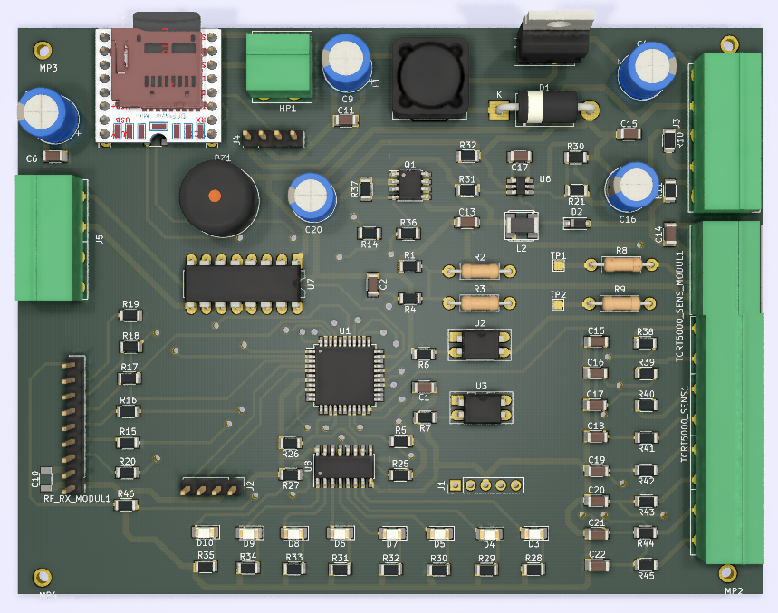
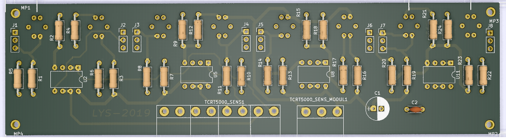

<h1 align="center">Line Following Train / Caterpillar</h1>

<p  align="center">
    

</p>

## Contents
- [Overview](#Overview)
- [How it works?](#How-it-works)
- [Used technologies](#Used-technologies)

## Overview
It is an autonomous vehicle that follows lines drawn on the ground in shopping malls or in a closed area and guides children around in wagons. It is more suitable for indoor use due to its sensor system. Various functions can be controlled remotely with the remote control given to the personnel.
 

## How it works?

It has an electronic circuit control system designed in accordance with the microcontroller embedded system architecture. According to the position information coming from the sensors, the amount of power to be given to the motors is calculated by the PID control system and a PWM signal is sent to the motors. Two 24V DC motors were used. These engines are the engines used in disabled vehicles. In case of leaving the line, the vehicle stops automatically.
<br>
<p  align="center">
    
</p>
<p  align="center"> Mother board.</p>

The status of the sensors can be observed with 8 LEDs on the PCB.
The vehicle is powered by two 12V batteries. The operating voltage is 24 V. It makes navigation more fun by playing music tracks loaded on the SD card.
<br>
<p  align="center">
    
</p>
<p  align="center">Sensor circuit.</p>


## Used technologies

```bash
- PIC18F45K22 MCU.
- CCS PIC C Compiler
- PID motor controller.
- Filter od sensors data.
- KiCAD PCB design.
- MP3 player

```

## Sample working video :

<a href="https://www.youtube.com/watch?v=0rQU3r0k7vE" target="_blank">
     
</a>


- GitHub [@your-ilyas9461](https://github.com/ilyas9461)
- Linkedin [@your-linkedin](https://www.linkedin.com/in/ilyas-yağcioğlu-6a6b17217)

### *** Note : 
Since the circuit is in industrial production, PCB circuit diagrams are not shared.
